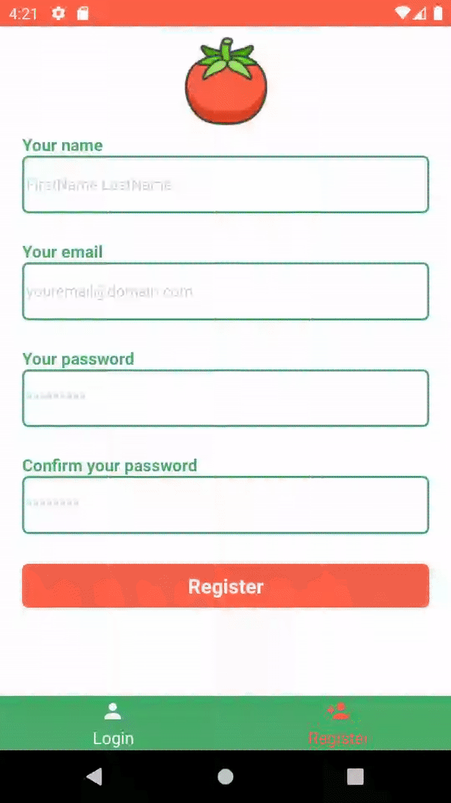

# Pomodoro (controle de atividades)

Backend -> [link](https://github.com/DaniloMarques1/pomodoro/tree/backend/backend)

Versão do app de pomodoros em typescript

## Funcionalidades

Ao criar uma tarefa (task) decidimos quantos pomodoros vamos dedicar para aquela tarefa. Um pomodo tem 25 minutos, caso você adicione uma tarefa e destine 3 pomodoros para ela teremos então 3 "rodadas" de 25 minutos (junto com os 5 minutos do break)

* Criar uma conta
* Logar
* Adicionar uma nova tarefa 
* Completar pomodoro(s)

## TODO

* [X] - Melhorar os formularios (keyboard/tab overlap, adicionar scrollView no form de registro)
* [ ] - Poder aumentar o timer/break do pomodoro na tela de perfil (o padrao eh 25 minutos/5)
* [X] - poder realizar um timer independente de uma atividade. Ou seja, poder fazer um pomodoro que nao esteja vinculado a nenhuma atividade (adicionar novo item no bottom menu "Pomodoro")
* [X] - Ajustar o keepawake para ele acontecer apenas na tela do timer.
* [X] - Ajustar para que cada acao de comunicao com o servidor tenha seu "loading" no redux

## Demonstração

